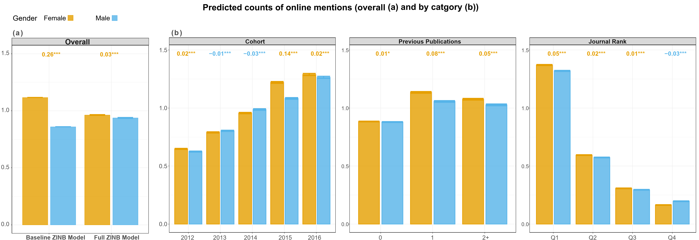
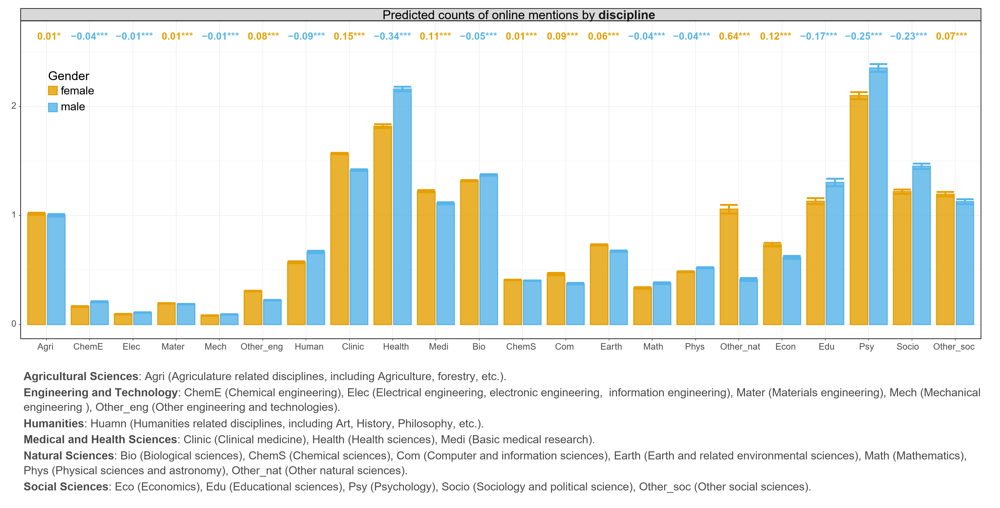
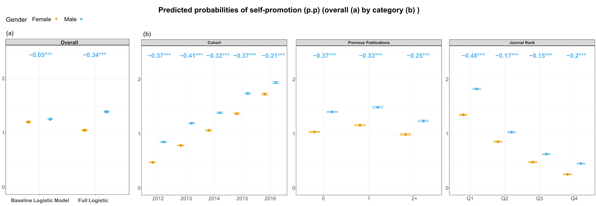
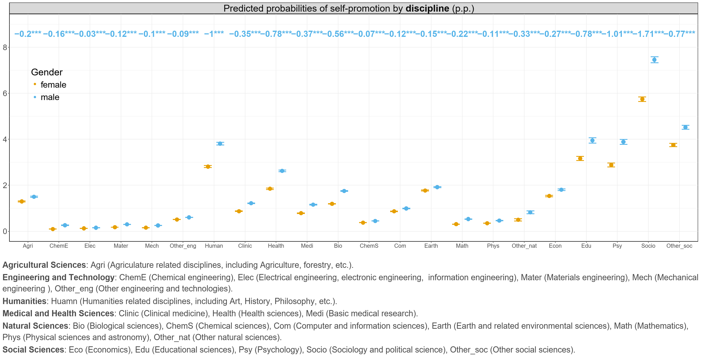
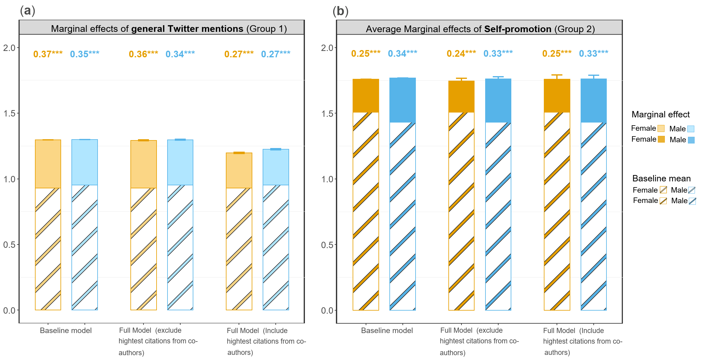

# Gender-differences-in-online-visibility-of-early-career-researchers
# Replication materials for: Gender differences in online visibility of early career researchers: Do female researchers benefit more from attention on social media? 
 
**Maintainer** Xinyi Zhao.

**Date of the last update**: 

**ORCID**: 0000-0002-2552-7795

**Institution1**: Max Planck Institute for Demographic Research, Rostock, Germany

**Institution2**: Leverhulme Centre for Demographic Science, Department of Sociology, University of Oxford, Oxford, UK

**WWW**: https://www.demogr.mpg.de/en/about_us_6113/staff_directory_1899/xinyi_zhao_4083/

**Email**: zhao@demogr.mpg.de

**Email2**: xinyi.zhao@st-hughs.ox.ac.uk

## Demo data

We prepared two demo datasets for the replication of our data analysis. Considering the licensed information from Scopus, we made the fake author_id and doi in the dataset. 


## Python requirements

For the reproducible pipeline to recreate the paper's replication data and migration measures, a conda environment with Python 3 (3.11.9 was used here) is needed. 
```yml

dependencies:
- python 3.*
- os
- pandas
- numpy
- pip:
  - pycountry_convert # (from Pypi, if gives error, comment out and after installation run "pip install pycountry_convert" in CLI)

```


## R packages

To replicate the statistical analysis, following packages should be installed.

```R

required_packages <- c("tidyverse","sjPlot","lme4", "dplyr", "car", "glmmTMB", "ggtext")

install_and_load <- function(packages) {
  for (pkg in packages) {
    if (!require(pkg, character.only = TRUE)) { # Check if the package is installed
      install.packages(pkg, dependencies = TRUE) # Install if not installed
      library(pkg, character.only = TRUE) # Load the package
    } else {
      library(pkg, character.only = TRUE) # Load if already installed
    }
  }
}

install_and_load(required_packages)


```
# Expected figures

Here we share the figures 1-5 in the main manuscript. All figures, including these and the Supplementary Information (SI) figures are available in the `2_results` folder.

## Figure 1: Predicted counts of Twitter mentions on early-career female and male researchers’ first publications.


## Figure 2: Predicted counts of Twitter mentions on early-career female and male researchers’ first publications by discipline.


## Figure 3: Predicted probabilities of early-career female and male researchers self-promoting their first publications.


## Figure 4: Predicted probabilities of early-career female and male researchers self-promoting their first publications by discipline.


## Figure 5: Average marginal effects of online visibility on the five-year cumulative discipline-normalized citation scores (DNCS) among early-career female and male researchers..


