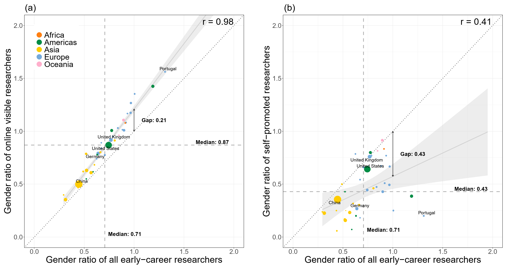
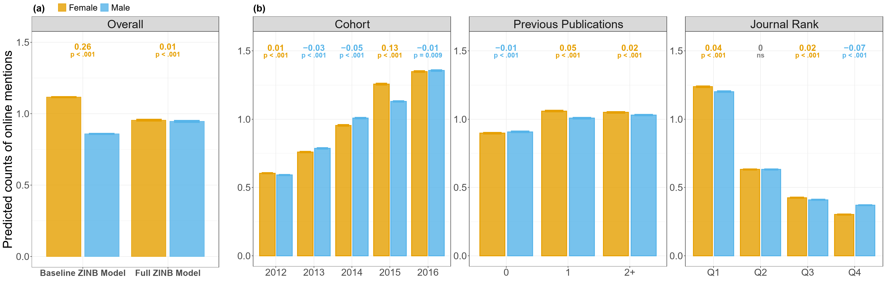
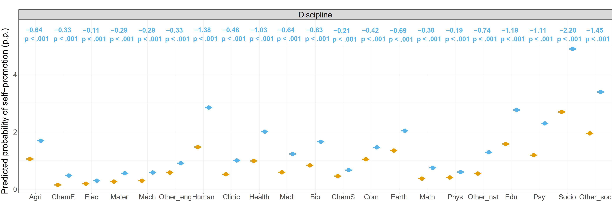
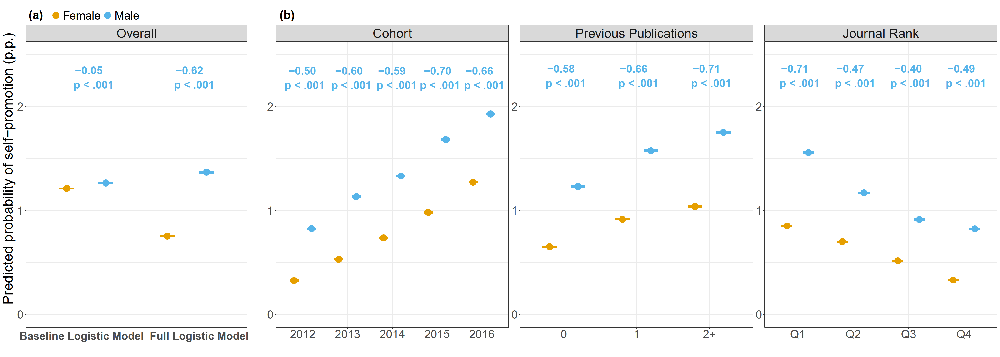
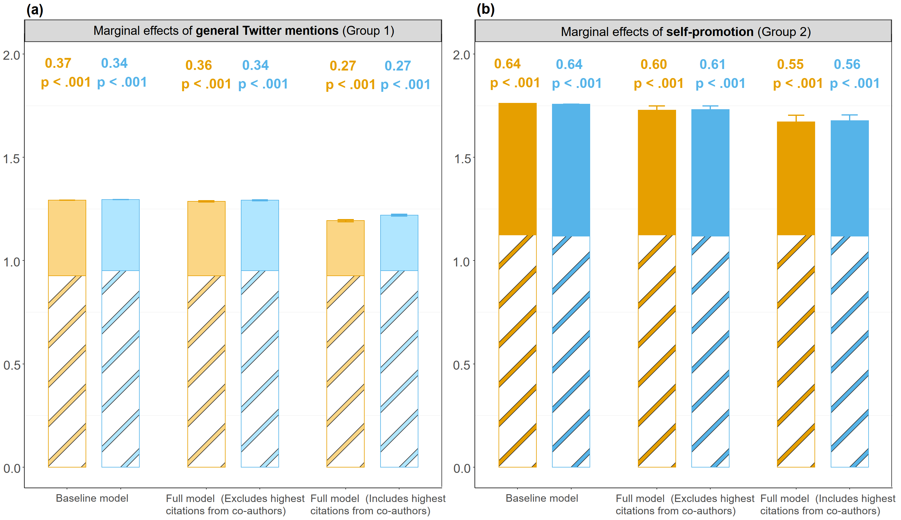

# Gender Differences in Online Visibility of Early-Career Researchers

## Replication materials

This repository contains replication materials for the manuscript:

> **Gender differences in online visibility of early-career researchers**

The repository provides demonstration/replication data and R scripts to reproduce the main analyses, tables, and figures in the manuscript.

**Maintainer:** Xinyi Zhao  
**ORCID:** 0000-0002-2552-7795  
**Affiliations:** Max Planck Institute for Demographic Research; Leverhulme Centre for Demographic Science, Department of Sociology, University of Oxford  
**Website:** https://www.demogr.mpg.de/en/about_us_6113/staff_directory_1899/xinyi_zhao_4083/  
**Email:** zhao@demogr.mpg.de; xinyi.zhao@st-hughs.ox.ac.uk

---

## Repository structure

```text
.
├── 0_code/
│   ├── 00_prepare_replication_data.R
│   ├── 01_correlation.R
│   ├── 03_online_mentions_models_figures.R
│   ├── 04_self_promotion_models_figures.R
│   ├── 05_matching_citation_analysis.R
│
├── 1_data/
│   ├── 01_dataset_demo.csv
│   ├── 00_field_discipline_OECD_author.csv
│   ├── corr.csv
│   ├── corr_agg.csv
│   ├── 1_author_12_16_psm_TW_No.csv
│   ├── 1_author_12_16_psm_self_other.csv
│   ├── 2_match_psm_TW_No
│   └── 2_match_psm_self_other.csv
│
├── 2_Result/
│   ├── Figures/
│   ├── Tables/
│   └── Models/
│ 
└── README.md
```

---

## Demo data

The original bibliometric data are subject to licensing restrictions. To support reproducibility, this repository provides demonstration data that follow the analytical structure used in the manuscript. Author identifiers and DOIs are anonymised or replaced with synthetic values.

---

## How to reproduce the analyses

Run the scripts from the repository root in the following order.

### 1. Prepare replication data

```r
source("00_prepare_replication_data.R")
```

**Inputs**

- `Data/01_datase_demo.csv`
  - Demonstration dataset containing a random sample of 5,000 early-career researchers. To comply with Scopus licensing and data-sharing restrictions, author identifiers have been randomized and selected variables have been anonymized or modified while preserving the data structure required to reproduce the   analytical workflow.
- `Data/00_field_discipline_OECD_author.csv`
  - OECD discipline classification used to assign researchers to research fields.

**Outputs**

- `Result/01_dataset_processed.csv`
- `Result/table1_cohort_by_gender.csv`
- `Result/table1_continuous_variables.csv`
- `Result/top20_countries.csv`
- `Result/countries_with_at_least_1000_researchers.csv`

---

### 2. Country-level correlation analyses

```r
source("01_correlation.R")
```

This script reproduces **Main Figure 1** and Supplementary Figures **S1-S7**.

**Inputs**

- `Data/corr.csv`
- `Data/corr_agg.csv`

**Outputs**

- `Result/Figures/`
- `Result/Tables/`

---

### 3. Online-visibility models and figures

```r
source("03_online_mentions_models_figures.R")
```

This script reproduces the online-visibility analyses for Twitter/X mentions, including **Main Figure 2** and Supplementary Figures **S10-S11**.

**Input**

- `Result/01_dataset_processed.csv`


**Outputs**

- `Result/Figures/Fig2_ab.pdf`
- `Result/Figures/Fig2_c.pdf`
- `Result/Figures/Fig_s10.pdf`
- `Result/Figures/Fig_s11.pdf`

---

### 4. Self-promotion models and figures

```r
source("04_self_promotion_models_figures.R")
```

This script reproduces the self-promotion analyses, including **Main Figure 3** and Supplementary Figures **S12-S13**.

**Input**

- `Result/01_dataset_processed.csv`

**Optional input**

- `Data/00_field_discipline_OECD_author.csv`

**Outputs**

- `Result/Figures/Fig3_ab.pdf`
- `Result/Figures/Fig3_c.pdf`
- `Result/Figures/Fig_S12.pdf`
- `Result/Figures/Fig_S13.pdf`

---

### 5. Matching and citation-impact analyses

```r
source("05_matching_citation_analysis.R")
```

This script reproduces the matching-based citation-impact analyses, including **Main Figure 4** and Supplementary Figures **S17-S18** and **S21-S22**.

By default, `RUN_MATCHING <- FALSE`, so the script uses the already matched datasets. Set `RUN_MATCHING <- TRUE` inside the script only if you want to rerun the propensity-score matching step from the unmatched input files.

**Main inputs**

- `Data/1_author_12_16_psm_TW_No.csv`
- `Data/1_author_12_16_psm_self_other.csv`
- `Data/2_match_psm_TW_No`
- `Data/2_match_psm_self_other.csv`

**Outputs**

- `Result/Figures/Fig4.pdf`
- `Result/Figures/Fig_S17.pdf`
- `Result/Figures/Fig_S18.pdf`
- `Result/Figures/Fig_S21.pdf`
- `Result/Figures/Fig_S22.pdf`


---

## Main manuscript figures

The current manuscript contains four main figures.

### Figure 1

Cross-national association between the gender female-to-male ratios of all early-career researchers and the gender ratios of:

1. online-visible researchers; and  
2. self-promoting researchers.

Produced by: `01_correlation.R`


### Figure 2

Predicted counts of Twitter/X mentions on early-career female and male researchers' first publications, overall, by cohort, previous publications, journal rank, and discipline.

Produced by: `03_online_mentions_models_figures.R`



### Figure 3

Predicted probabilities of early-career female and male researchers self-promoting their first publications, overall, by cohort, previous publications, journal rank, and discipline.

Produced by: `04_self_promotion_models_figures.R`



### Figure 4

Average marginal effects of online visibility and self-promotion on five-year cumulative discipline-normalized citation scores among early-career female and male researchers.

Produced by: `05_matching_citation_analysis.R`


---

## R package requirements

The scripts install or check most required packages automatically. Across the full replication pipeline, the following R packages are used:

```r
c(
  "dplyr", "readr", "tidyr", "forcats", "stringr", "purrr",
  "ggplot2", "ggrepel", "countrycode", "broom", "patchwork", "scales",
  "glmmTMB", "sjPlot", "ggeffects", "ggtext", "MatchIt", "sandwich",
  "lmtest", "effectsize"
)
```

The package `ggpattern` is optional. If it is not installed, Figure 4 will be drawn without hatching.

---

## Notes on paths

All scripts use relative paths and should be run from the repository root. Input files should be stored in `Data/`. Outputs are written to `Result/`, especially `Result/Figures/`, `Result/Tables/`, and `Result/Models/`.

---

## Citation

If you use these replication materials, please cite the corresponding manuscript:

Zhao, X., Akbaritabar, A., Kashyap, R., & Zagheni, E. *Gender differences in online visibility of early-career researchers*.
