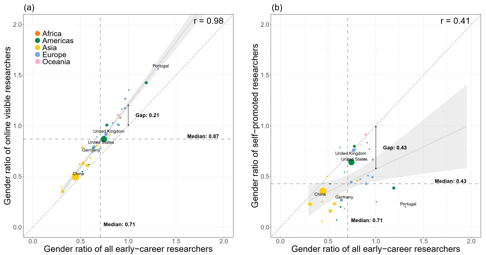
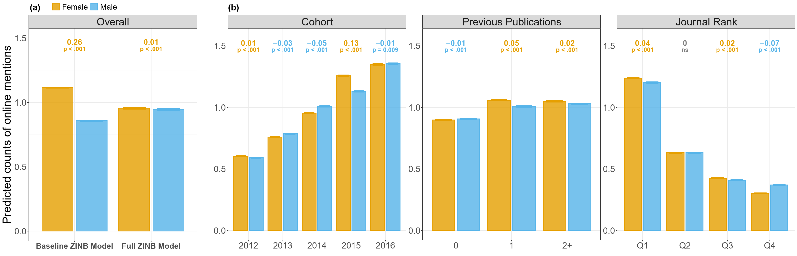
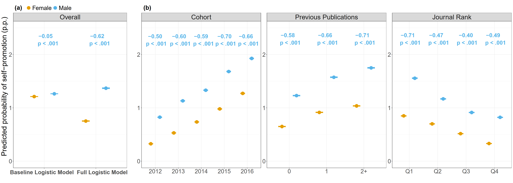
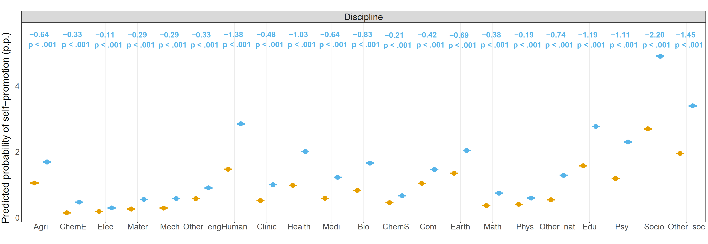
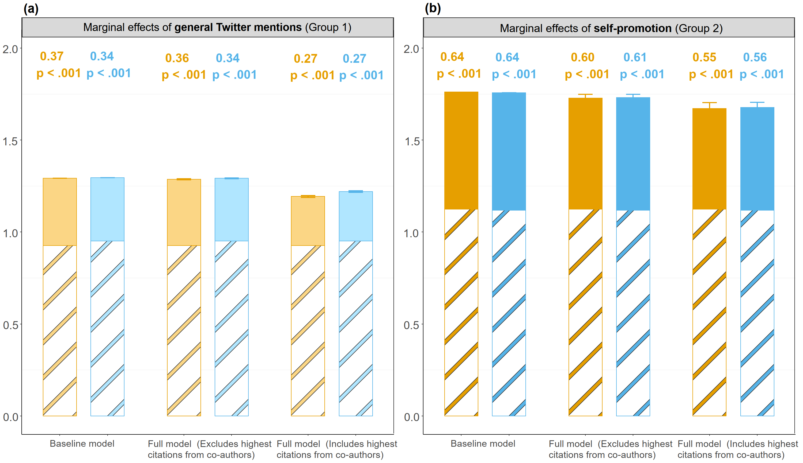

# Gender Differences in Online Visibility of Early-Career Researchers

## Replication materials

This repository contains the replication materials for the manuscript:

> **Gender differences in online visibility of early-career researchers**
>
> Zhao, X., Akbaritabar, A., Kashyap, R., & Zagheni, E.

It provides de-identified demonstration data and the full code (R scripts and Python notebooks) used to produce every main and supplementary figure and table in the manuscript. Each figure is saved together with a source-data table of the same name.

**Maintainer:** Xinyi Zhao  
**ORCID:** 0000-0002-2552-7795  
**Affiliations:** Max Planck Institute for Human Development; Max Planck Institute for Demographic Research  
**Website:** https://zxy919781142.github.io/  
**Email:** zhao@demogr.mpg.de

---

## Repository structure

```text
.
├── 0_code/
│   ├── 1_Data_Processing_new.ipynb          # data collection: Scopus sample, Altmetric, Twitter API
│   ├── 2_self_promotion_new.ipynb           # name matching -> self-promotion flag
│   ├── 01_correlation.R                     # Fig. 1, Figs. S1-S3, S5-S7, Tables S3-S6
│   ├── 02_online_mentions_models_figure.R   # Fig. 2, Figs. S10-S11, Tables S7-S8
│   ├── 03_self_promotion_models_figures.R   # Fig. 3, Figs. S12-S15, Table S10
│   ├── 04a_run_matching.R                   # propensity-score matching, Figs. S16, S20
│   ├── 04b_matching_regression_figures.R    # Fig. 4, Figs. S17-S19, S21-S22, Tables S14-S15
│   ├── SI_robustness_gender_ratio.ipynb     # threshold sweep (Fig. S9 input) + validation sample
│   ├── SI_robustness_gpt_validation.ipynb   # LLM-assisted validation (Fig. S8 input)
│   ├── SI_robustness_S8_S9.R                # Figs. S8-S9
│   ├── SI_matching_test.R                   # Tables S12-S13 (balance tests)
│   └── SI_Tweet_Text_cleaned.ipynb          # Figs. S23-S26, Tables S16-S17 (tweet text)
│
├── 1_data/                                  # input data (demo versions)
│
├── 2_result/                                # intermediate files (processed data, matched data, models)
│
├── figures/                                 # every figure (PDF), named fig_1.pdf ... fig_s26.pdf
│   └── png/                                 # PNG previews of the main figures (shown below)
│
├── tables/                                  # source data for every figure + supplementary tables
│
└── README.md
```

---

## Output naming

Every figure in `figures/` has a source-data table with the same name in `tables/`, so each plotted value can be traced:

| Figure | Source data |
|---|---|
| `figures/fig_1.pdf` | `tables/fig_1.csv` (+ `fig_1_correlation.csv`) |
| `figures/fig_2ab.pdf`, `fig_2c.pdf` | `tables/fig_2ab.csv`, `fig_2c.csv` |
| `figures/fig_3ab.pdf`, `fig_3c.pdf` | `tables/fig_3ab.csv`, `fig_3c.csv` |
| `figures/fig_4.pdf` | `tables/fig_4.csv` |
| `figures/fig_s1.pdf` ... `fig_s26.pdf` | `tables/fig_s1.csv` ... `fig_s26.csv` |

Notes:

- Where a figure combines panels (e.g. `fig_2ab`), its table contains all panels, identified by a `fig_panel` column.
- Figs. S2 and S6 are drawn from the same country-level data, so they share `tables/fig_s2_s6.csv` (and `fig_s2_s6_correlation.csv`). Likewise, Figs. S3 and S7 share `tables/fig_s3_s7.csv`.
- Figs. S23 and S25 consist of separate female and male panels: `fig_s23_female` / `fig_s23_male` and `fig_s25_female` / `fig_s25_male`, in both `figures/` and `tables/`.
- Figs. S24 and S26 have an additional `*_summary.csv` with descriptive statistics of the tag distributions.
- Fig. S4 is a schematic of the name-matching workflow and is not generated by code.
- Supplementary tables are saved in `tables/` as `table_s1.csv` ... `table_s17.csv` (no suffix). A `table_sN.csv` is always the Supplementary Table N itself; the source data of Supplementary Figure N is always `fig_sN.csv`.

---

## Data

The original bibliometric and social-media data cannot be redistributed:

- **Scopus** publication and author data are subject to licensing restrictions.
- **Altmetric** mention data were obtained under licences held separately by the Max Planck Institute for Demographic Research and the University of Oxford.
- **Twitter/X** data (tweet text, timestamps, and user profiles) were collected via the Twitter Academic API before April 2023.

To support reproducibility, `1_data/` contains demonstration data that follow the structure used in the analysis. The demo data cover a random sample of early-career researchers; author identifiers and DOIs are anonymised or replaced with synthetic values, and selected variables are modified while preserving the structure required to run the full workflow. Results obtained from the demo data will therefore differ from those reported in the manuscript.

---

## How to reproduce the analyses

Run all scripts **from the repository root**, so that the relative paths (`1_data/`, `2_result/`, `figures/`, `tables/`) resolve correctly. Output folders are created automatically.

### Step 0 (optional). Data collection and self-promotion identification — Python

These notebooks document how the analytical dataset was built. They require the full licensed data and API credentials, and are **not needed** to reproduce the figures from the demo data.

| Notebook | Purpose |
|---|---|
| `1_Data_Processing_new.ipynb` | Selects each author's first publication (2012–2016 cohorts) and their early-career publications; queries the Altmetric API for original tweets; queries the Twitter API for tweet text and tweeter identity. |
| `2_self_promotion_new.ipynb` | Matches author names to the names and handles of Twitter users who tweeted the publication's DOI, and flags self-promotion (similarity thresholds: 0.6 in general, 0.8 for Chinese names). |

API keys are read from environment variables (`ALTMETRIC_API_KEY`, `TWITTER_BEARER_TOKEN`, `TWITTER_API_KEY`, `TWITTER_API_SECRET`, `TWITTER_ACCESS_TOKEN`, `TWITTER_ACCESS_SECRET`) and are never stored in the code.

### Step 1. Country-level correlations — `01_correlation.R`

```r
source("0_code/01_correlation.R")
```

- **Inputs:** `1_data/01_corr.csv` (country × cohort), `1_data/01_corr_agg.csv` (country, cohorts pooled)
- **Figures:** `fig_1`, `fig_s1`, `fig_s2`, `fig_s3`, `fig_s5`, `fig_s6`, `fig_s7`
- **Tables:** matching source data, plus `table_s3.csv`–`table_s6.csv` (correlations by cohort)

### Step 2. Online-visibility models — `02_online_mentions_models_figure.R`

```r
source("0_code/02_online_mentions_models_figure.R")
```

Fits zero-inflated negative binomial (ZINB) models of Twitter/X mention counts (Models 0–9).

- **Input:** `1_data/dataset_demo.csv`
- **Intermediate output:** `2_result/dataset_demo_processed.csv` (used by Steps 3 and 4), `2_result/online_mentions_zinb_models.rds`
- **Figures:** `fig_2ab`, `fig_2c`, `fig_s10`, `fig_s11`
- **Tables:** matching source data, plus `table_s7.csv` (zero-inflation ORs) and `table_s8.csv` (count-component IRRs)

### Step 3. Self-promotion models — `03_self_promotion_models_figures.R`

```r
source("0_code/03_self_promotion_models_figures.R")
```

Fits logistic models of self-promotion (Models 0–10) and of promotion by co-authors and by official accounts.

- **Input:** `2_result/dataset_demo_processed.csv` (from Step 2)
- **Figures:** `fig_3ab`, `fig_3c`, `fig_s12`, `fig_s13`, `fig_s14`, `fig_s15`
- **Tables:** matching source data, plus `table_s10.csv` (self-promotion ORs)

### Step 4. Matching and citation impact — `04a_run_matching.R`, then `04b_matching_regression_figures.R`

```r
source("0_code/04a_run_matching.R")
source("0_code/04b_matching_regression_figures.R")
```

`04a` runs the propensity-score matching (Matching 1: Twitter mentions vs. no mentions; Matching 2: self-promotion vs. others' promotion only). `04b` fits the citation-impact regressions on the matched data. The matching step is slow, so it is kept separate: once `04a` has run, `04b` can be re-run on its own.

- **Input (04a):** `2_result/dataset_demo_processed.csv` (from Step 2)
- **Intermediate output (04a):** `2_result/2_match_psm_TW_No`, `2_result/2_match_psm_self_other.csv`
- **Additional input (04b):** `2_result/2_match_psm_TW_No_basic_fncr_exNan_nov2024_1121_selfdiscipline_subclass.csv` — the matched sample for the exactly-one-mention robustness check (Fig. S19)
- **Figures:** `fig_s16`, `fig_s20` (04a: covariate balance); `fig_4`, `fig_s17`, `fig_s18`, `fig_s19`, `fig_s21`, `fig_s22` (04b)
- **Tables:** matching source data, `table_s14.csv` and `table_s15.csv` (AMEs for Matching 1 and 2, the estimates shown in Fig. 4a/4b), balance tables of the matching step, and cluster-robust regression tables

### Step 5. Robustness of the name-matching thresholds — Figs. S8–S9

Run in this order:

1. `SI_robustness_gender_ratio.ipynb` — sweeps pairs of similarity thresholds and computes the female-to-male ratio of self-promoting researchers (Fig. S9 input); draws the validation sample.
2. `SI_robustness_gpt_validation.ipynb` — judges each sampled match with an LLM, applies the manual review, and computes precision/recall/F1 per threshold pair (Fig. S8 input). Requires the environment variable `GWDG_API_KEY`.
3. `SI_robustness_S8_S9.R` — draws `fig_s8` and `fig_s9` and writes their source data.

These steps require the name-matching scores from Step 0 and therefore the full data.

### Step 6. Tweet text analysis — `SI_Tweet_Text_cleaned.ipynb`

Classifies the sentiment of tweets (majority vote of three classifiers) and analyses their wording and use of tags.

- **Input:** `1_data/clean_for_Git/TW_text.csv`
- **External dependency:** the modules `Py/nlp_test.py` and `Py/sentiment_analysis.py` and their pre-trained model files (`1_data/Py/`)
- **Figures:** `fig_s23_female`, `fig_s23_male`, `fig_s24`, `fig_s25_female`, `fig_s25_male`, `fig_s26`
- **Tables:** matching source data, plus `table_s16.csv` and `table_s17.csv` (sentiment by gender)

### Balance tests — `SI_matching_test.R`

Re-matches the Step 4 samples with additional exact-matching criteria and writes the covariate-balance tables for the top 20 countries: `table_s12.csv` (Matching 1) and `table_s13.csv` (Matching 2), plus `matching_test_1_TW_balance_tests.csv`. Run after `04a_run_matching.R`.

---

## Main figures

### Figure 1

Cross-national association between the female-to-male ratios of all early-career researchers and those of (a) online-visible researchers and (b) self-promoting researchers.

Produced by: `01_correlation.R`



### Figure 2

Predicted counts of Twitter/X mentions of early-career female and male researchers' first publications: overall, and by cohort, previous publications, journal rank, and discipline.

Produced by: `02_online_mentions_models_figure.R`




### Figure 3

Predicted probabilities of early-career female and male researchers self-promoting their first publications: overall, and by cohort, previous publications, journal rank, and discipline.

Produced by: `03_self_promotion_models_figures.R`




### Figure 4

Average marginal effects of online visibility and self-promotion on five-year cumulative discipline-normalized citation scores (DNCS⁵) among early-career female and male researchers.

Produced by: `04b_matching_regression_figures.R`



---

## Software requirements

### R

The R scripts check for or install their required packages. Across the pipeline, they use:

```r
c(
  "dplyr", "tidyr", "readr", "purrr", "forcats", "stringr", "tidyverse",
  "ggplot2", "ggrepel", "ggtext", "cowplot", "patchwork", "scales",
  "countrycode", "broom", "broom.mixed", "glmmTMB", "effectsize",
  "MatchIt", "sandwich", "lmtest"
)
```

The package `ggpattern` is optional; without it, Figure 4 is drawn without hatching.

### Python

The notebooks use `pandas`, `numpy`, `matplotlib`, `scipy`, `scikit-learn`, `openai`, `transformers`, `torch`, `wordcloud`, `textblob`, `langid`, and `translate`.

---

## Citation

If you use these replication materials, please cite the associated manuscript:

Zhao, X., Akbaritabar, A., Kashyap, R., & Zagheni, E. *Gender differences in online visibility of early-career researchers*.

Please also cite the archived GitHub/Zenodo repository associated with this project:
**DOI: 10.5281/zenodo.20773808**
